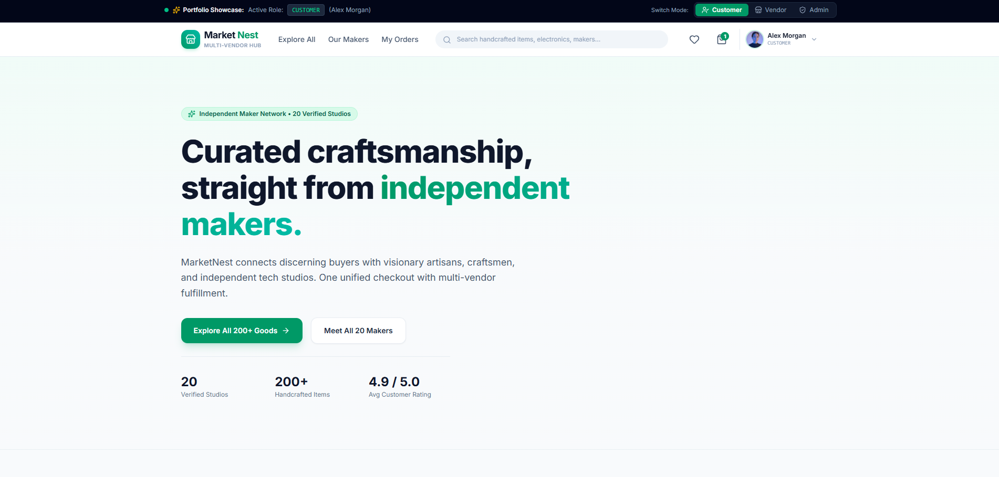

<div align="center">



<br/>
<br/>

# 🛍️ MarketNest — Curated Multi-Vendor Marketplace

**A full-featured, production-grade multi-vendor e-commerce platform built with Next.js 16, React 19, and Tailwind CSS v4.**

<br/>

[](https://nextjs.org/)
[](https://react.dev/)
[](https://www.typescriptlang.org/)
[](https://tailwindcss.com/)
[](https://www.framer.com/motion/)
[](./LICENSE)

<br/>

> **Developed as a Frontend Development Internship Project @ [WebEra Solutions PK](https://weberasolutionspk.com/)**

<br/>

[🚀 Live Demo](https://imtiazaly.github.io/MarketNest-Multi-Vendor-Marketplace/) · [📁 Source Code](https://github.com/imtiazaly/MarketNest-Multi-Vendor-Marketplace) · [🐛 Report Bug](https://github.com/imtiazaly/MarketNest-Multi-Vendor-Marketplace/issues)

</div>

---

## 📖 Table of Contents

- [✨ Project Overview](#-project-overview)
- [🖼️ Preview](#%EF%B8%8F-preview)
- [🎯 Core Features](#-core-features)
- [🔐 Role-Based System](#-role-based-system)
- [🗂️ Pages & Routes](#%EF%B8%8F-pages--routes)
- [🏗️ Architecture & Tech Stack](#%EF%B8%8F-architecture--tech-stack)
- [📁 Project Structure](#-project-structure)
- [⚡ Getting Started](#-getting-started)
- [🧩 Context API Architecture](#-context-api-architecture)
- [👨‍💻 Developer](#-developer)

---

## ✨ Project Overview

**MarketNest** is a fully functional, multi-vendor e-commerce marketplace where independent artisans, craftsmen, and boutique tech studios can sell their handcrafted products directly to discerning buyers — all under one roof with **unified multi-vendor checkout**.

This is a **frontend-only, client-rendered SPA** built with the latest Next.js App Router, powered by **React Context API** for state management and **localStorage** for session persistence — no backend or database required for demo purposes.

The platform simulates a real-world marketplace with:
- **20 verified independent vendor studios** across 5 product categories
- **200+ handcrafted product listings** with reviews, ratings, and stock tracking
- **Three distinct user roles** — Customer, Vendor, and Admin — each with its own protected dashboard
- **Real-time cart, wishlist, and order management** with persistent localStorage sessions

---

## 🎯 Core Features

### 🛒 Customer Experience
| Feature | Description |
|---|---|
| **Smart Product Search** | Real-time search across title, category, and vendor name |
| **Category Filtering** | Browse by Electronics, Fashion, Home & Living, Art & Crafts, Wellness |
| **Product Detail Pages** | Full product description, image gallery, ratings, reviews, and stock |
| **Slide-over Cart Drawer** | Instant cart feedback with quantity controls, subtotal, tax, and shipping |
| **Wishlist Management** | Save favorite items with persistent localStorage state |
| **Multi-Vendor Checkout** | Single checkout flow aggregating products from multiple independent vendors |
| **Order History** | Track all past orders with real-time status updates |
| **User Authentication** | Register, login, and profile management with localStorage persistence |

### 🏪 Vendor Portal
| Feature | Description |
|---|---|
| **Vendor Dashboard** | KPI cards: Gross Sales, Active Catalog, Incoming Orders, Studio Rating |
| **Inventory Management** | View, add, and delete products from your store catalog |
| **Add Product Modal** | Full product form with title, price, compare-at price, category, stock, image URL, and tags |
| **Order Fulfillment** | View incoming orders and update order statuses per-studio |
| **Public Storefront** | Each vendor has a dedicated public-facing storefront page |
| **Role-Guarded Access** | Vendor portal is protected — non-vendors are auto-redirected |

### 🔰 Admin Governance Panel
| Feature | Description |
|---|---|
| **Platform Metrics** | Total GMV (Gross Merchandise Value), platform commission (10%), registered studios, and catalog size |
| **Vendor Oversight** | Full table of all 20 studios with location, catalog size, gross sales, ratings, and compliance status |
| **Order Stream** | Consolidated platform-wide order feed with real-time status filtering and management |
| **Catalog Moderation** | Search and audit all product listings; remove non-compliant items |
| **Role-Guarded Access** | Admin panel is protected — non-admins are auto-redirected |

---

## 🔐 Role-Based System

MarketNest features a **3-tier role-based access control (RBAC)** system with a convenient **Demo Role Switcher Banner** at the top of every page — designed to showcase all three user perspectives seamlessly during portfolio demos or recruiter evaluations.

```
┌─────────────────────────────────────────────────────────┐
│  ⚡ Portfolio Showcase Banner  [Customer] [Vendor] [Admin]│
└─────────────────────────────────────────────────────────┘
```

| Role | Access | Route |
|---|---|---|
| 👤 **Customer** | Browse products, cart, checkout, wishlist, orders, profile | `/`, `/products`, `/checkout`, `/orders`, `/wishlist`, `/profile` |
| 🏪 **Vendor** | Full merchant dashboard, product/order management | `/vendor` *(protected)* |
| 🔰 **Admin** | Platform governance, studio oversight, catalog moderation | `/admin` *(protected)* |

> **Quick Login:** Use the top banner to instantly switch between roles without any signup. Each role loads with realistic mock data pre-populated.

---

## 🗂️ Pages & Routes

```
/                         → Homepage (Hero, Featured Products, Vendor Spotlight, Fresh Drops)
/dashboard                → 📊 Customer Dashboard (KPIs, orders, spending, wishlist, quick links)
/products                 → Full product catalog with search, filter, sort, compare
/products/[slug]          → Product detail page (images, reviews, add-to-cart)
/vendors                  → All 20 vendor studios directory
/vendors/[id]             → Individual vendor storefront (banner, products, stats)
/checkout                 → Multi-vendor unified checkout with address & payment
/orders                   → Customer order history & tracking
/wishlist                 → Saved items / favorites
/profile                  → User profile settings & avatar management
/login                    → Email-based authentication
/register                 → New account creation (customer or vendor role)
/vendor                   → 🔒 Vendor Dashboard (role-protected)
/admin                    → 🔒 Admin Governance Panel (role-protected)
```

---

## 🏗️ Architecture & Tech Stack

```
┌──────────────────────────────────────────────────────────────┐
│                    MarketNest — Tech Stack                   │
├──────────────────┬───────────────────────────────────────────┤
│ Framework        │ Next.js 16.3.6 (App Router)               │
│ UI Library       │ React 19.2.8                              │
│ Language         │ TypeScript 5.x                            │
│ Styling          │ Tailwind CSS v4 + PostCSS                 │
│ Animations       │ Framer Motion 13.x                        │
│ Icons            │ Lucide React 1.48                         │
│ Class Utilities  │ clsx + tailwind-merge                     │
│ State Mgmt       │ React Context API (4 global contexts)     │
│ Persistence      │ localStorage (cart, session, wishlist)    │
│ Data Layer       │ Static mock data (TypeScript typed)       │
│ Font             │ Inter (Google Fonts)                      │
└──────────────────┴───────────────────────────────────────────┘
```

### Why these choices?

- **Next.js App Router** — Modern React Server Components architecture with file-based routing and layout nesting
- **React 19** — Latest React with concurrent features and the React Compiler (Babel plugin enabled)
- **Tailwind CSS v4** — Utility-first with `@tailwindcss/postcss` — zero config, no `tailwind.config.js` needed
- **Framer Motion** — Smooth, production-quality UI animations with minimal boilerplate
- **Context API** — Lightweight, dependency-free global state management for a frontend-only project
- **TypeScript** — Full type safety across all data models, context contracts, and component props

---

## 📁 Project Structure

```
marketnest/
├── public/
│   └── marketnest.PNG          # Project preview screenshot
│
├── src/
│   ├── app/                    # Next.js App Router pages
│   │   ├── layout.tsx          # Root layout (Navbar, Footer, Providers, CartDrawer)
│   │   ├── page.tsx            # Homepage
│   │   ├── admin/page.tsx      # 🔒 Admin Governance Portal
│   │   ├── checkout/page.tsx   # Multi-vendor Checkout
│   │   ├── dashboard/page.tsx  # 📊 Customer Dashboard (KPIs, orders, wishlist, spending)
│   │   ├── login/page.tsx      # Authentication
│   │   ├── register/page.tsx   # Registration
│   │   ├── orders/page.tsx     # Order History & Tracking
│   │   ├── products/
│   │   │   ├── page.tsx        # Product catalog (search/filter/compare)
│   │   │   └── [slug]/page.tsx # Product Detail Page
│   │   ├── profile/page.tsx    # User Profile & Settings
│   │   ├── vendor/page.tsx     # 🔒 Vendor Dashboard
│   │   ├── vendors/
│   │   │   ├── page.tsx        # All Vendors Directory
│   │   │   └── [id]/page.tsx   # Individual Vendor Storefront
│   │   └── wishlist/page.tsx   # Wishlist
│   │
│   ├── components/             # Shared UI components
│   │   ├── Navbar.tsx          # Sticky navbar with search, cart, user dropdown
│   │   ├── Footer.tsx          # Site footer
│   │   ├── CartDrawer.tsx      # Slide-over cart panel
│   │   ├── CompareModal.tsx    # 🆕 Side-by-side product comparison modal (up to 3)
│   │   ├── ProductCard.tsx     # Reusable product card (with compare toggle)
│   │   ├── VendorCard.tsx      # Reusable vendor card
│   │   └── RoleSwitcherBanner.tsx  # Portfolio demo role switcher
│   │
│   ├── context/                # Global state management
│   │   ├── AppProviders.tsx    # Composes all context providers
│   │   ├── AuthContext.tsx     # User sessions, login, register, profile
│   │   ├── CartContext.tsx     # Cart state, totals, shipping, tax
│   │   ├── CompareContext.tsx  # 🆕 Product comparison list (max 3), modal control
│   │   ├── WishlistContext.tsx # Wishlist add/remove/persist
│   │   └── MarketplaceContext.tsx  # Products, vendors, orders, CRUD operations
│   │
│   ├── data/
│   │   └── mockData.ts         # 20 vendors, 200+ products, orders, users (fully typed)
│   │
│   ├── types/
│   │   └── index.ts            # TypeScript interfaces: User, Vendor, Product, Order, etc.
│   │
│   └── lib/
│       └── utils.ts            # Helper utilities: formatPrice, formatDate, cn()
│
├── package.json
└── README.md
```

---

## ⚡ Getting Started

### Prerequisites

- **Node.js** `>= 18.x`
- **npm** / **yarn** / **pnpm**

### Installation & Local Development

```bash
# 1. Clone the repository
git clone https://github.com/imtiazaly/MarketNest-Multi-Vendor-Marketplace.git

# 2. Navigate into the project directory
cd MarketNest-Multi-Vendor-Marketplace

# 3. Install dependencies
npm install

# 4. Start the development server
npm run dev
```

Open [http://localhost:3000](http://localhost:3000) in your browser.

> **No environment variables, no database setup, no backend required.** The entire app runs on static TypeScript mock data and localStorage.

### Available Scripts

```bash
npm run dev       # Start development server with hot reload
npm run build     # Create optimized production build
npm run start     # Start production server (after build)
npm run lint      # Run ESLint across the codebase
```

---

## 🧩 Context API Architecture

The application uses **4 independent React Contexts**, composed together via `AppProviders`:

```
<AppProviders>
 ├── <AuthProvider>          → currentUser, login, register, logout, quickLogin, updateProfile
 ├── <MarketplaceProvider>   → products, vendors, orders, addProduct, deleteProduct, createOrder, updateOrderStatus
 ├── <CartProvider>          → cart, addToCart, removeFromCart, subtotal, tax, shippingFee, total
 ├── <WishlistProvider>      → wishlist, addToWishlist, removeFromWishlist, isInWishlist
 └── <CompareProvider>       → compareList (max 3), addToCompare, removeFromCompare, isInCompare, openCompare
```

Each context exposes a typed custom hook (`useAuth`, `useMarketplace`, `useCart`, `useWishlist`) for clean, ergonomic consumption across all pages and components.

### Data Flow

```
mockData.ts (static seed)
       ↓
MarketplaceContext (products, vendors, orders — runtime CRUD)
       ↓
Page / Component (reads & writes via context hooks)
       ↓
localStorage (cart, session, wishlist — persistent across refreshes)
```

---

## 🎨 Design System

| Token | Value |
|---|---|
| **Primary Color** | Emerald `#059669` |
| **Admin Accent** | Purple `#7C3AED` |
| **Background** | Slate `#F8FAFC` |
| **Card Surface** | White with `border-slate-200` |
| **Border Radius** | `rounded-2xl` / `rounded-3xl` |
| **Typography** | Inter (Google Fonts) |
| **Shadow System** | `shadow-2xs`, `shadow-xs`, `shadow-xl` |

---

## 👨‍💻 Developer

<div align="center">

**Imtiaz Ali**
Frontend Development Intern @ **WebEra Solutions PK**

*This is my 2nd and final internship project, built to demonstrate real-world frontend engineering skills including component architecture, state management, routing, UI/UX design, and full multi-role application structure.*

<br/>

[](https://github.com/imtiazaly)
[](https://www.linkedin.com/in/imtiaz-ali-79476a385/?isSelfProfile=true)

<br/>

> *"Built with ❤️, Tailwind, and too many cups of chai."*

</div>

---

<div align="center">

**⭐ If you found this project helpful or impressive, please star the repository! ⭐**

<sub>© 2026 Imtiaz Ali — Internship Project @ WebEra Solutions PK. All rights reserved.</sub>

</div>
